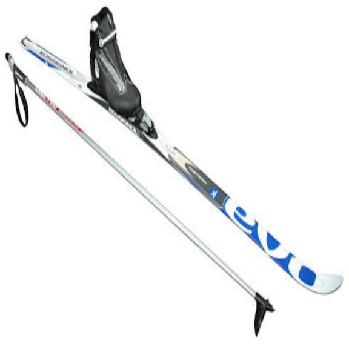

## Gear ##

The basic equipment required are as follows: **skis** with bindings, **boots**, and **poles**.

Cross-country skiing has two main technique branches: classic and skating. The style you partake in will dictate what equipment you will need.

 Each technique necessitates its own respective suite of skis, bindings, shoes, and poles. Classic cross-country skis differ from skating skis not only in their length but also in their configuration.

Classic skis are designed for groomed trails (tracks). They are slightly longer than skating skis and are significantly more narrow and lightweight. These characteristics make the skis fast and efficient.