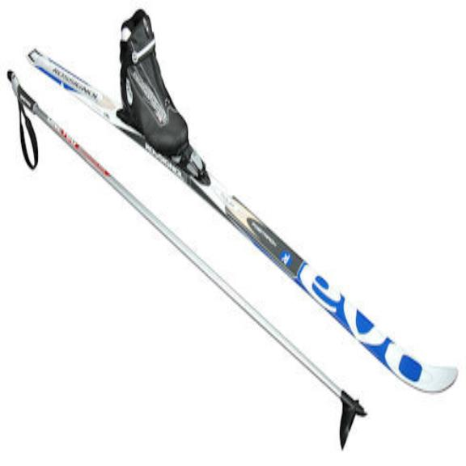

 

Cross-country skiing is a form of skiing where participants ski across flat or undulating terrain, as opposed to downhill skiing. 

It is a popular winter sport and recreational activity that involves propelling oneself over snow-covered landscapes using skis and poles.

 Unlike , which emphasizes descending slopes, cross-country skiing focuses on horizontal movement over varying terrains in contrast to downhill skiing where you descend the slope.

It is both a competitive sport, with events such as the Nordic skiing disciplines in the Winter Olympics, and a popular recreational activity enjoyed by individuals of all skill levels. Moreover, some still use it as a means of transportation.

It is an excellent cardiovascular workout, engaging various muscle groups, and offers a unique way to experience the winter landscape.

## The origins ##
 Its history goes way back to the ancient times. The word ski comes from the Old Norse word skíð which means a stick of wood. Skiing started as a technique for traveling cross-country over snow on skis, starting almost five millennia ago in Scandinavia, but it may have been practised as early as 600 BCE in China. Additionally, the Sami people have practiced skiing for more than 6000 years.

Early skiers used one long pole or spear in addition to the skis. The first depiction of a skier with two ski poles dates to 1741. Traditional skis, used for snow travel in Norway and elsewhere into the 1800s, often comprised one short ski with a natural fur traction surface, the andor, and one long for gliding, the langski—one being up to 100 cm longer than the other—allowing skiers to propel themselves with a scooter motion.

Then over the centuries, cross-country skiing evolved from a utilitarian means of transportation to being a worldwide recreational activity and sport, which branched out into other forms of skiing starting in the mid-1800s. Norwegian skiing regiments organized military skiing contests as early as in the 18th century. An early record of a public ski competition occurred in Tromsø in 1843.

In Norwegian, langrenn refers to "competitive skiing where the goal is to complete a specific distance in groomed tracks in the shortest possible time". Using this definition as the backbone of its further development, skiing evolved into a competitive form of winter sports. The first FIS Nordic World Ski Championships took place in 1925 for men and in 1954 for women, and the first Winter Olympic Games were held in Chamonix, France, in 1924. After World War II, the World Championships were held every four years from 1950 to 1982. Since 1985, the World Championships have been held in odd-numbered years.

A new technique, skating, was experimented in the early 20th Century, but was not widely adopted until the 1980s. Johan Grøttumsbråten used the skating technique at the 1931 World Championships in Oberhof, one of the earliest recorded use of skating in competitive cross-country skiing. This technique was later used in ski orienteering in the 1960s on roads and other firm surfaces. Skiers such as Bill Koch from America, Ove Aunli from Norway and Pauli Siitonen from Finland brought the technique to public attention in the late 70s and early 80s, and it was widely adopted since the 1985 World Championships in Seefeld. It has since become the fastest technique in skiing and extremely popular among elite and recreational skiers. Naturally, classic technique remained, and due to the popularity of long distance skiing, double-poling has recently become the “third technique” in cross-country skiing.

Long distance skiing, or marathon skiing, has been around ever since the latter part of the 19th century. Vasaloppet in Sweden, since 1922, and Oulun Tervahiihto, since 1889, in Finland are the oldest public ski races in the world. These classic events paved the way for other international long distance ski organizers, and in 2011 Ski Classics, now Visma Ski Classics, solidified the sport form, which has become a spectacle in its own right followed by over a million TV viewers and participated by thousands of skiers, Pro and recreational ones alike.

## Gear ##

The basic equipment required are as follows: **skis** with bindings, **boots**, and **poles**.

Cross-country skiing has two main technique branches: classic and skating. The style you partake in will dictate what equipment you will need.

 Each technique necessitates its own respective suite of skis, bindings, shoes, and poles. Classic cross-country skis differ from skating skis not only in their length but also in their configuration.

Classic skis are designed for groomed trails (tracks). They are slightly longer than skating skis and are significantly more narrow and lightweight. These characteristics make the skis fast and efficient.

## Outfit ##

### Base layers ###
 

*Base layers* are close-fitting garments that are often made of wool or polypropylene (fancy plastic). Some folks refer to these as long underwear.

 They wick moisture away from your skin and help you retain heat. They are lightweight, breathable, and allow for a full range of motion. Base layers are typically composed of wind briefs (wind blocking) or underwear, then a pair of leggings and a long sleeve top.

They don’t have to be the most high-tech, however I would be cautious of picking out something too heavy. Heavy base layers can easily get saturated with sweat. Look for something made of a lightweight material, that breathes well, and is not made of cotton. 

### Middle layers ##

Your *mid-layer* typically is going to be a cross-country specific jacket, or a winter running jacket and a pair of cross-country pants. If you’re a cool cat, you could also ski in a wool sweater. 

Cross-country specific jackets and pants will often have ventilation near the back with wind blocking material in the front. Much like the base layers, you’ll want something that is lightweight and allows for a full range of motion. 

For an added layer of warmth, you should wear an insulated vest over your jacket.

### Outer layers ###

Your *outer layer* is going to be for your extra warm jacket, and occasionally your big snow pants. These should be big enough to fit over the other layers previously mentioned. 

The pants are really reserved for if you are on touring skis moving slowly, coaching at a race, or you’re doing a cooldown after your race.

### Head and neck ###

When skiing in truly cold conditions, any exposed skin can quickly show signs of frostbite.

Start with wearing a hat (or touque for our Canuck friends to the North).Your body loses about 10% of its heat through your head. Much like the base layer, aim to have a lightweight wool or polypropylene cap.

Cover your neck with a gaiter. Again, lightweight and breathable is the name of the game. 

### Hands and feet ###

Your hands and feet are particularly susceptible to the cold. 

The most important thing to keep your hands and feet warm is to maintain a warm torso. When your body gets cold, its first instinct is to pull blood away from the surface of the skin and extremities.

 To prevent this, keep your skin covered, and your torso warm.

For your hands, mittens are the way to go. 

## Body preparation ##

In cross-country skiing, you will be moving mostly on thre flat terrain. However, at times you will need to go up gentle the slopes. As such, this requires lots of energy, stamina, and speed control. This is one of the most demanding cardio activities in the world.

Therefore, you need to exercise both your stamina and your core strength. Also, do not forget about the appropriate fuel for you muscles so that you can make them grow.

To sum up, "all" you need to succeed is: cardio training,
working on your core and appropriate nutrition.

### Cardio training ###

Before you get on the trail, start doing your cardio to build endurance by running, biking, or even kayaking.

With time and practice, you may feel like taking up some HIIT trainings as well. You can easily achieve that by tossing in a few intervals in between. For instance, you could go hard for 30 seconds and then take a minute break in between or do a low-intensity activity – such as brisk walking.

Also, activities such as hiking, trail running, biking, and even surfing can be excellent when cross-training for skiing. These can help build strength and power in the legs, improve cardiovascular fitness, and increase endurance. You will also learn how to read terrain and navigate obstacles when skiing.

Roller skiing is another form of dryland training that cross-country skiers can perform off-season. This will also help you practice techniques and improve your overall endurance. As you can see, there are skills that you can transfer from these activities that can be immensely helpful when skiing.

### Working on your core ###
 

For a nordic skier, training your arms is as important as cardio. In fact, cross-country skiers rely on upper body power for up to 50% of their power output. 

While cardio helps you build endurance, you need your core to be strong as well in order to ski. The power of your propulsion comes from your abs and lower back; therefore, you will need to focus on strength exercises targeting these parts. Also, you need your core to be strong in order to ski. 

Focus on strength exercises targeting your abs and lower back.
Try:

1. crunches
2. windshield wipers
3. Russian twists
4. supine leg lifts
5. supermans.

### Nutrition ###
 
What you eat as crucial as your training. You will need carbohydrates to fuel your functions. So choose a diet with low sugar and fat while including high fiber carbohydrate alternatives like whole-grain bread, cereals, and grains.

Some skiers also prefer to take vitamin D since the winter months might not offer sufficient sunlight. While skiing, you should also remember to stay hydrated, preferably with water, and avoid caffeine. Also, the best choice would be a low-fat protein bar that will help to keep your energy up.